# Hệ thống nhận diện biển số xe Việt Nam 
# (Vietnamese License Plate Recogniton System Based On YOLOv8 & PaddleOCR (Deep Learning Code + UI Interface Implementaion))

(Bạn đọc có thể để lại cho nhóm 1 Start nếu thấy hứng thú và có ích ^^. Nhóm xin cảm ơn!!!)

## 1. Giới thiệu 
Trong bối cảnh giao thông đô thị ngày càng phức tạp, việc phát hiện và nhận diện các phương
tiện giao thông trở nên cực kỳ quan trọng nhằm phục vụ cho các tác vụ khác như tự động xử lý
các phương tiện vượt đèn đỏ, không đội mũ bảo hiểm, không tuân thủ biển báo giao thông,... Việc
không tuân thủ luật giao thông không chỉ gây ra nguy cơ tai nạn mà còn làm tăng tình trạng ùn tắc
giao thông, ảnh hưởng đến cuộc sống hàng ngày của người dân. Để giải quyết vấn đề này, nhiều
công nghệ tiên tiến đã được nghiên cứu và áp dụng, trong đó có sự phát triển mạnh mẽ của các
thuật toán học sâu và trí tuệ nhân tạo. Đề tài "Nhận diện biển số xe Việt Nam theo thời gian thực" tập
trung vào việc sử dụng các công nghệ tiên tiến như YOLOv8, Paddle OCR và DeepSORT để xây
dựng một hệ thống tự động phát hiện phương tiện và biển số xe theo thời gian thực.
## 2. Phương pháp
### a. Tổng quan quy trình
Bắt đầu với việc thu thập dữ liệu, nhóm tận dụng nhiều nguồn khác
nhau, bao gồm dữ liệu trên Roboflow, các videos từ camera giám sát giao thông trên youtube, để
được một tập dữ liệu đa dạng. Nhóm áp dụng tiền xử lý dữ liệu trên nền tảng Roboflow. Đối
với tác vụ phát hiện đối tượng, nhóm sử dụng YOLOv8, tận dụng tốc độ xử lý nhanh và khả
năng nhận diện chính xác. Song song với đó, PaddleOCR được sử dụng cho tác vụ nhận diện ký tự
quang học (OCR). Sự kết hợp giữa YOLOv8 và PaddleOCR để giải quyết đồng thời hai tác vụ phát
hiện và nhận dạng, nâng cao hiệu quả của tổng thể hệ thống. Để tăng tính chính xác và tính hữu
dụng của hệ thống, nhóm triển khai một giai đoạn xử lý hậu kỳ để kiểm tra và chuẩn hóa kết
quả nhận diện biển số xe. Cuối cùng, toàn bộ thông tin sẽ được hiển thị thông qua giao diện người
dùng được tạo ra bởi Framework Pyqt5 giúp người dùng dễ dàng theo dõi.
<p align="center">
  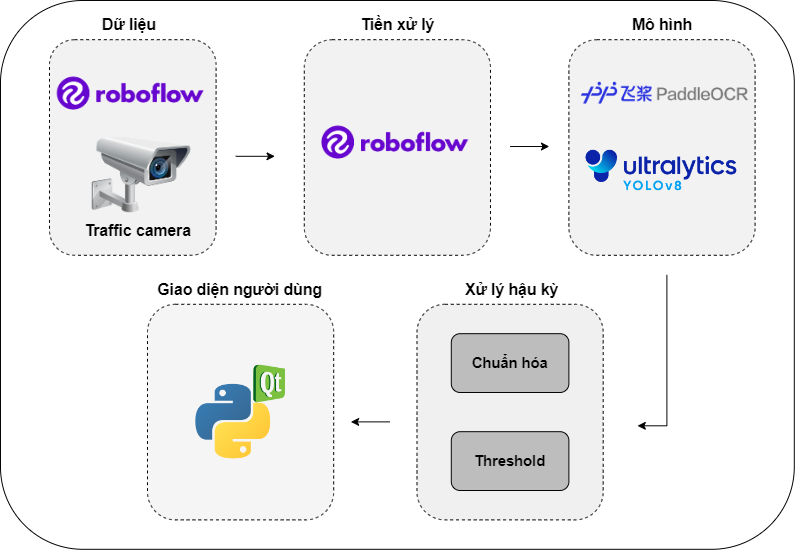
</p>
Đầu tiên, dữ liệu được đưa vào file tuning YOLOv8m để phát hiện tất cả các phương tiện, đồng thời thuật toán tracking
DeepSort sẽ theo dõi các phương tiện này qua các khung hình, duy trì tính liên tục của biển số xe.
Tiếp theo, biển số xe sẽ được cắt ra từ file tuning YOLOv8s và đưa vào các mô hình của PaddleOCR để trích xuất ký tự.
Các kỹ thuật xử lý hậu kỳ được thêm vào để cải thiện độ chính xác của mô hình. Thông tin và hình
ảnh biển số xe sẽ được lưu lại để sử dụng trong tương lai.
<p align="center">
  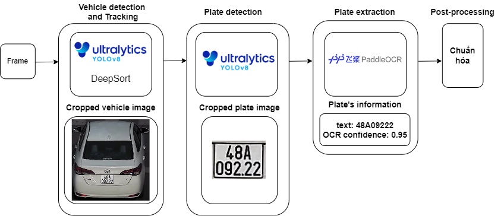
</p>

### b. Nhận diện biển số xe
Quá trình bắt đầu với đầu vào là một ảnh chứa biển số xe đã được cắt ra từ quá trình nhận diện,
sau đó được đưa vào mô hình Paddle OCR để xử lý. Bước tiếp theo trong phần này là xác định
chính xác các vùng văn bản trong mỗi dòng của biển số. Phương pháp này
đảm bảo rằng việc trích xuất thông tin tiếp theo được thực hiện với độ chính xác cao.
Trong các trường hợp phát hiện hai dòng, mô hình sẽ thực hiện việc kết hợp một cách liền mạch,
gộp hai dòng lại với nhau để tạo thành biển số hoàn chỉnh. Các thông tin được lưu sẽ bao gồm text
biển số, ID, điểm tin cậy.
<p align="center">
  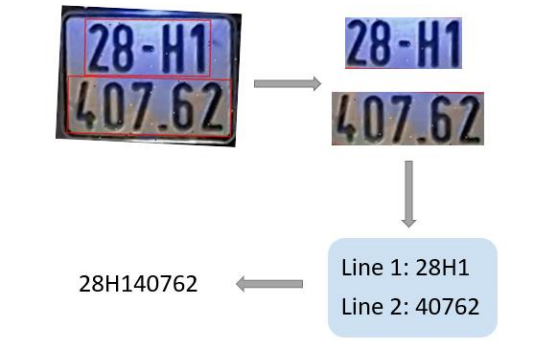
</p>

### c. Kỹ thuật xử lý hậu kỳ 
Nhiệm vụ trong giai đoạn xử lý hậu kỳ là kiểm tra tính đúng đắn từng ký tự, trong đó mỗi
ký tự phải đáp ứng các điều kiện nghiêm ngặt để xác thực tính hợp lệ của nó. Định dạng biển số
Việt Nam có các dạng: NNA-NNNN, NNA-NNNNN, NNAA-NNNN, NNAA-NNNNN, NNAN-
NNNN, NNAN-NNNNN trong đó N đại diện cho số và A đại diện cho ký tự chữ cái. Ký tự thứ ba
luôn là một chữ cái trong bảng chữ cái tiếng Anh. Trong trường hợp ký tự thứ ba được nhận diện
là một số, chúng em sẽ chuyển đổi nó trở lại thành chữ cái dựa trên sự tương đồng, ví dụ "8" thành
"B", "4"thành "A". Các ký tự còn lại khi được nhận diện là chữ cái, cũng sẽ được chuyển đổi thành
số theo bảng dưới đây. Việc kiểm tra như vậy tăng tính chính xác của hệ thống.
<p align="center">
  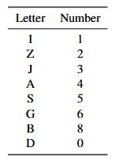
</p>

### d. Giới thiệu bộ dữ liệu 
Có 2 tập dữ liệu để huấn luyện cho ra hai models phát hiện phương tiện giao thông và phát hiện
biển số xe.
Mô hình phát hiện phương tiện giao thông được huấn luyện trên tập dữ liệu "LuanVan Computer
Vision Project"được đăng trên Roboflow với 2012 ảnh với độ phân giải có các kích thước khác
nhau, bao gồm 1920 x 1080, 605 x 605, 605 x 806. Dữ liệu sau đó được resize thành 640 x 640.
Dữ liệu mẫu như hình dưới:
<p align="center">
  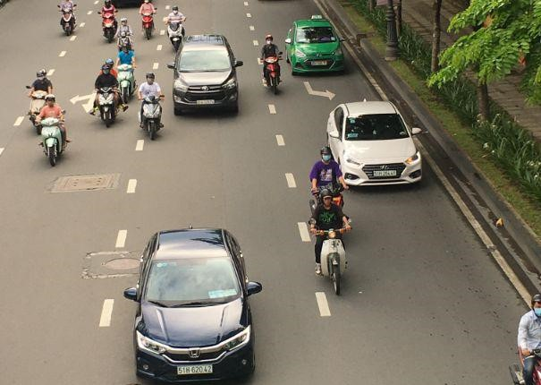
</p>
Mô hình phát hiện biển số xe được huấn luyện trên tập dữ liệu "Vietnam license-plate Computer
Vision Project"được đăng trên Roboflow với 1005 ảnh với độ phân giải 472 x 303. Dữ liệu sau đó
được resize thành 320 x 320. Dữ liệu mẫu như hình dưới:
<p align="center">
  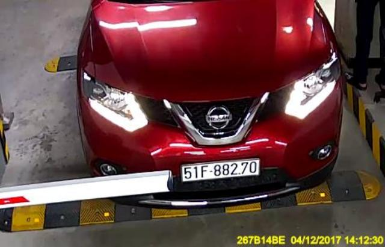
</p>

## 3. Xây dựng app 
### a. Các công nghệ chính được sử dụng 
* PyQT5
* Python3
* OpenCV
* PyTorch
### b. Triển khai hệ thống
Về kiến trúc hệ thống, nhóm đã phân chia rõ ràng 3 cấp độ để đảm bảo nhiệm vụ được xử
lý chính xác, dễ dàng bảo trì và nâng cấp. Lớp xử lý (Processing Layer) là lõi thông minh của hệ
thống, bao gồm lớp YOLOv8Detector, DeepSort và PaddleOCR chịu trách nhiệm xử lý từng frame
của video và đưa ra kết quả nhận diện. Lớp giao diện (Interface Layer) là một cửa sổ mà qua đó
người dùng tương tác với hệ thống, cung cấp môi trường vận hành thân thiện với người dùng thông
qua các yếu tố UI trực quan như nút và nhãn, giúp người dùng dễ dàng thao tác và nhận được phản
hồi. Đảm bảo rằng tất cả các bộ phận của hệ thống hoạt động phối hợp và đáp ứng bằng cách xử
lý đầu vào của người dùng, kiểm soát luồng dữ liệu và lập kế hoạch hoạt động của các bộ xử lý và
mô hình phương tiện.
<p align="center">
  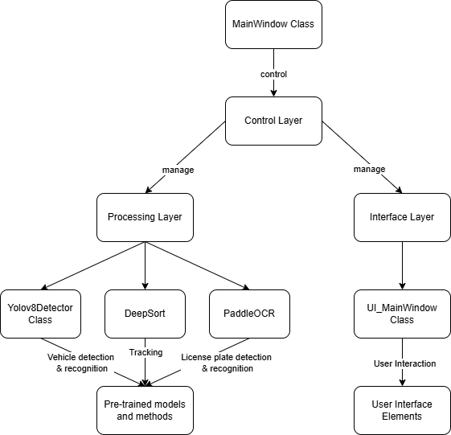
</p>

### c. UI MainWindow
<p align="center">
  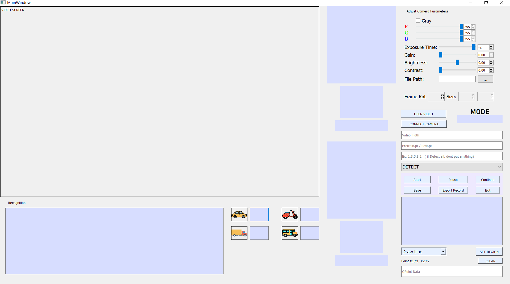
</p>

## 4. Running 
### a. File System 
- File detectors/yolov8: chứa code fine-tune model YOLOv8 trên dataset phương tiện và biển
số xe Việt Nam.
- File ppor_onnx: chứa code ứng dụng Paddle OCR để đọc biển số xe Việt Nam.
- File tracking: chứa code ứng dụng thuật toán Sort, DeepSort để tracking.
- File utils: chứa code xử lý các thao tác như cắt ảnh phương tiện, cắt ảnh biển số xe, kiểm tra
size ảnh, kiểm tra độ uy tín của nhận diện biển số xe,...
- File weights: chứa weights của mô hình YOLOv8 và Paddle OCR.
- File CamShow1.py: code chạy hệ thống giao diện người dùng.
- File main.py: code chạy hệ thống nhận diện biển số xe Việt Nam.
- File my_alpr5.py, my_alpr5.ui: thiết kế giao diện người dùng bằng Qt Designer.
### b. Running trên file main.py 
Để chạy được và test tất cả các tính năng của models, ta sử dụng tập lệnh để chạy file main.py:
```
python main.py --video [path_to_your_video] [optional arguments]
```
Arguments:
* --video: (str) đường dẫn đến thư mục chứa video, 0 để bật chế độ camera
* --save: (bool) bật chế độ lưu video đã được nhận diện
* --save_dir: (str) đường dẫn đến thư mục lưu
* --vehicle_weight: (str) đường dẫn đến thư mục chứa weights của YOLOv8 pre-trained
model nhận diện phương tiện
* --plate_weight: (str) đường dẫn đến thư mục chứa weights của YOLOv8 pre-trained
model nhận diện biển số xe
* --vconf: (float) điều chỉnh độ tin cậy cho vehicle detection
* --pconf: (float) điều chỉnh độ tin cậy cho plate detection
* --ocrconf_thres: (float) ngưỡng tin cậy cho mô hình OCR
* --stream: (bool) giám sát thời gian thực
* --read_plate: (bool) bật chế độ nhận diện biển số xe, không dùng câu lệnh này nếu chỉ
bật chế độ nhận diện phương tiện
* --deepsort: (bool) sử dụng DeepSort để tracking thay vì Sort thông thường
Nếu người dùng không sử dụng các optional arguments trên thì sẽ chuyển về các thông số mặc
định do người lập trình đặt ra.
### c. Test
Ta sử dụng câu lệnh sau để bật chế độ giám sát thời gian thực, mô hình YOLOv8 sẽ được kích
hoạt với hai nhiệm vụ phát hiện và theo dõi (sử dụng thuật toán SORT) phương tiện:
```
python -u "D:\license-plate-recognition-main\main.py" --video "D:\license-plate-recognition-
main\data\16.mp4" --stream
```
<p align="center">
  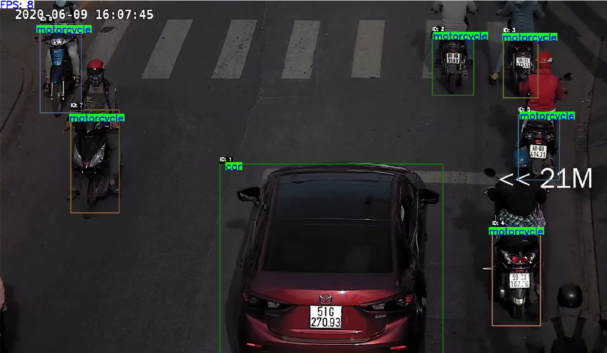
</p>

Để dùng thuật toán DeepSort tiến hành tracking, đồng thời bật chế độ nhận diện biển số xe giám
sát thời gian thực, lưu các thông tin như ảnh phương tiện, ảnh biển số xe, ta sử dụng câu lệnh sau
trên Terminal:
```
python -u "D:\license-plate-recognition-main\main.py" --video "D:\license-plate-recognition-
main\data\2.mp4" --stream --deepsort --readplate --save
```
<p align="center">
  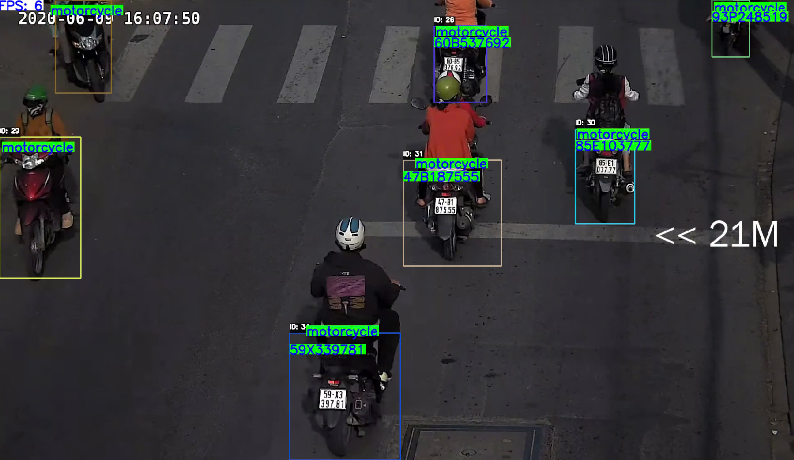
</p>

<p align="center">
  
</p>

### d. Test app
<p align="center">
  
</p>

## 5. Nhận xét và đánh giá 
### a. Hiệu suất 
Hệ thống được chạy trên cấu hình phần cứng Intel i5 12500H, RTX 2050, 16GB RAM, cho
ra tốc độ khung hình (FPS) dao động từ 10 đến 30 trong các tình huống giao thông có số lượng
phương tiện thay đổi liên tục. Đây có thể coi là cấu hình yếu khi đem đi triển khai, tuy nhiên nếu
xét ở giai đoạn thử nghiệm, kết quả cho thấy hệ thống hoạt động tốt ngay cả trên các thiết bị có
phần cứng yếu.
<p align="center">
  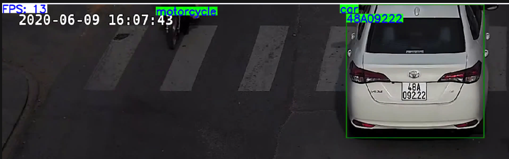
</p>

### b. Độ chính xác 
Theo thử nghiệm, hệ thống đạt độ chính xác 86% trong điều kiện ngoài trời và tình huống giao
thông phức tạp, đông phương tiện. Đây là một kết quả ấn tượng, chứng tỏ khả năng của hệ thống
trong việc xử lý các tình huống giao thông thực tế với nhiều yếu tố nhiễu loạn.

### c. Khả năng mở rộng 
Hệ thống có tính linh hoạt cao với khả năng thay đổi mô hình trong hệ thống. Điều này cho
phép chúng ta dễ dàng cập nhật hoặc nâng cấp các mô hình khi có cải tiến mới, từ đó duy trì và
nâng cao hiệu suất của hệ thống theo thời gian.

### d. Giao diện người dùng 
Giao diện người dùng được xây dựng bằng PyQt5 tạo cảm giác dễ sử dụng, giúp người dùng
không chuyên cũng có thể vận hành hệ thống một cách hiệu quả. Ngoài tính năng nhận diện, theo
dõi và đếm, hệ thống còn tích hợp thêm một số tính năng khác hỗ trợ tối đa cho người dùng tương
tác.

### e. Hạn chế 
- Hệ thống vẫn còn một số vấn đề cần được giải quyết. Đầu tiên, việc nhận diện phương tiện đôi
khi không chính xác do hiện tại đang sử dụng mô hình YOLOv8s, YOLOv8n có thể dẫn đến kết
quả phát hiện sai. Ngoài ra, các vấn đề liên quan đến việc nhận diện biển số trong điều kiện ánh
sáng kém hoặc bị che khuất vẫn là một trong những thách thức cần được giải quyết.
- Nhóm còn hạn chế về việc thu thập dữ liệu về phương tiện giao thông Việt Nam và sử dụng
các phương pháp tăng cường dữ liệu chưa tốt dẫn đến việc fine-tune mô hình chưa hiệu quả, hiệu
suất mà các mô hình đem lại chưa thực sự cao.
- Nhóm mới xây dựng được hệ thống nhận diện biển số xe Việt Nam với input đầu vào là video
có sẵn, chưa phải từ camera giám sát.
- Hạn chế về kiến thức xây dựng hệ thống phần mềm khiến cho nhóm
chưa tối ưu hoá được nhiều khả năng kết hợp giữa các tính năng.

## 6. Tác giả 
Sinh viên K66 ngành Máy tính và Khoa học thông tin - Trường Đại học Khoa học Tự nhiên, Đại học Quốc gia Hà Nội.

[Phòng thí nghiệm của đệ tử pháp sư Loki](https://github.com/jtaddrocket)

[itsZiang](https://github.com/itsZiang)

## 7. Tài liệu tham khảo 
* [YOLOv8](https://github.com/ultralytics/ultralytics?tab=readme-ov-file)
* [Paddle OCR](https://github.com/PaddlePaddle/PaddleOCR)
* [ByteTrack](https://docs.ultralytics.com/vi/modes/track/#tracking-arguments)
* [DeepSort](https://github.com/nwojke/deep_sort)
* [Sort](https://github.com/abewley/sort)
* [Intelligent-Traffic-Based-On-CV](https://github.com/Kevinnan-teen/Intelligent-Traffic-Based-On-CV?tab=readme-ov-file)
* [license-plate-recognition](https://github.com/tungedng2710/license-plate-recognition?fbclid=IwY2xjawEVkhZleHRuA2FlbQIxMAABHagUsytDTAnrpsBruPhEaEZ96e80taegmX6txNrIW1mn-pVqkWAXS3uOqA_aem_m1Xq30PC85lTGPIflJs3NA)
* 


